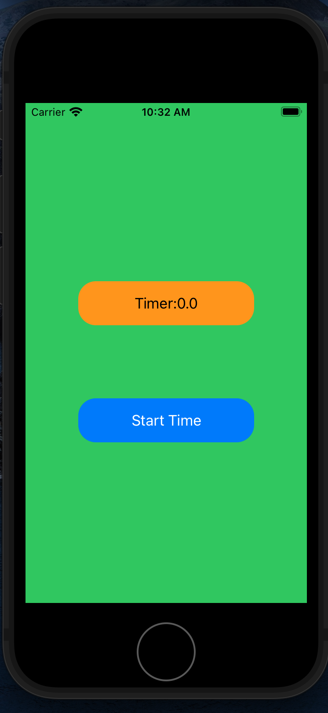

# TimerApp

TimerAppとはタイマー機能を実現したiOSアプリである。

# DEMO
 
 TimerAppを実際にシュミレータとして動かした動画がこちら

<video width="320" height="240" controls>
<source src="image/Timermovie.mp4">
</video>
 
# Requirement
 
使用テキストエディタ

・Xcode

使用言語

・Swift

 
# Installation
 
 Xcodeのインストール方法

 AppStoreでインストールができます。

下記のリンクをクリックしてインストールを開始。

 

＊XcodeをインストールできるのはMacOS対応のみであるため、

Windowsではインストールできません。

 <a half="https://apps.apple.com/jp/app/xcode/id497799835?mt=12">https://apps.apple.com/jp/app/xcode/id497799835?mt=12</a>

# Author
 ・Name
 
 Rion

 ・Twitter

 <a half="https://twitter.com/rion0489xx">https://twitter.com/rion0489xx</a>